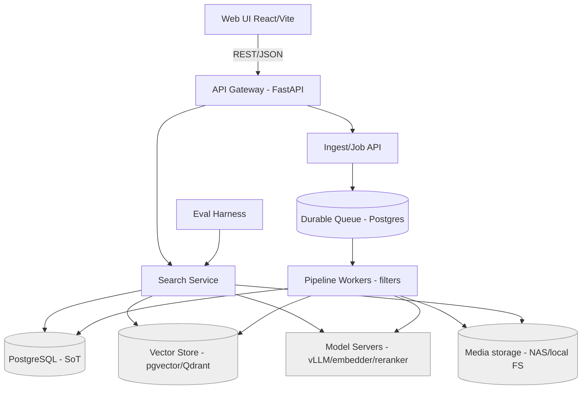
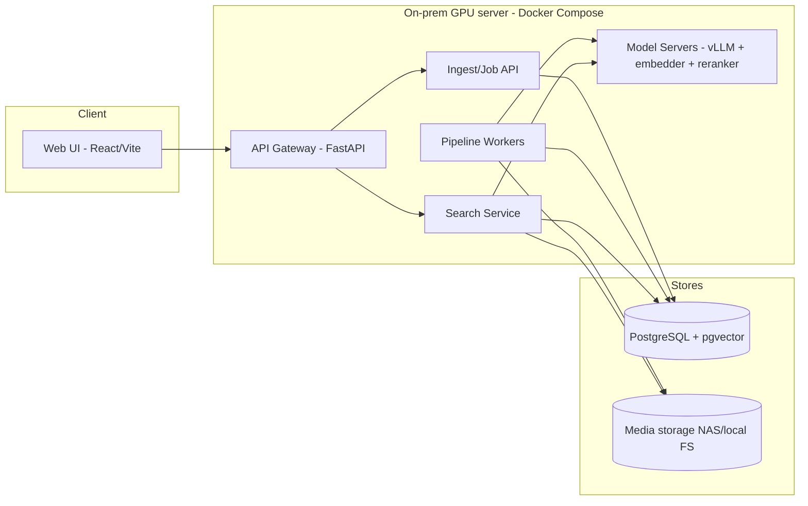
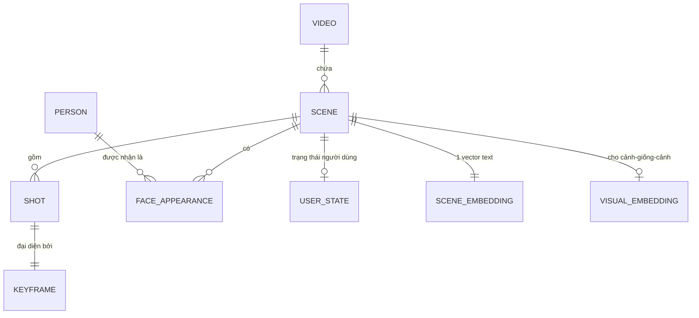

# Architecture Spine — scene-intelligence

## Design Paradigm

**Pipes-and-Filters (ingest, write side) + Search Service (read side), tách theo CQRS-lite, quanh một "xương sống 3 kho".**

- **Ingest** là chuỗi *filter* idempotent nối bằng hàng đợi bền: `detect → keyframe → enrich* → describe → embed → index`. Mỗi filter đọc Scene, ghi phần của mình, đẩy tiếp.
- **Search Service** chỉ đọc, hiện thực phễu 4 tầng cố định; không đụng pipeline.
- **API** là ranh giới UI↔lõi; sở hữu tương tác người dùng (auth, "đã dùng").
- **3 kho**: Postgres (nguồn sự thật) · Vector store (dẫn xuất) · Object storage (media).

Ánh xạ thư mục ở [Structural Seed](#structural-seed).

## Invariants & Rules

Sơ đồ hướng phụ thuộc (ai được phụ thuộc ai) — là một *rule*, không chỉ minh hoạ:



Quy tắc: mũi tên chỉ một chiều. **UI không bao giờ chạm DB/kho trực tiếp** (chỉ qua API). **Search không ghi enrichment; Pipeline không ghi user-state.**

### AD-1 — Scene là đơn vị index & trả về; `scene_id` là danh tính ỔN ĐỊNH `[ADOPTED]`
- **Binds:** all, FR-2, FR-6, FR-12
- **Prevents:** index/trả kết quả ở mức Video; và `used`/tham chiếu dán nhầm nội dung sau khi re-ingest re-mint id
- **Rule:** mọi kết quả định danh bằng `scene_id` + `(video_id, start_ms, end_ms)`; không có "kết quả" ở mức Video. `scene_id` là **id bất biến** gán lúc detect lần đầu (UUID hoặc content-hash), **không** phải số thứ tự vị trí; re-detect phải **ánh xạ vào scene_id cũ**, không sinh id mới. Thứ tự vị trí `_s<n>` chỉ là thuộc tính hiển thị, không phải danh tính.

### AD-2 — CQRS-lite: tách write (ingest) khỏi read (search)
- **Binds:** all
- **Prevents:** nhịp ghi-nặng-GPU và đọc-nhẹ-nhanh dẫm chân, không scale độc lập
- **Rule:** ingest và search là hai tiến trình/triển khai tách biệt, chỉ giao tiếp qua 3 kho; không gọi hàm chéo trong tiến trình.

### AD-3 — Single-writer trên mỗi data-domain
- **Binds:** all
- **Prevents:** hai chủ cùng ghi một entity (pipeline vs API cùng sửa Scene)
- **Rule:** **Pipeline** là chủ ghi *enrichment* (metadata Scene, scene_document, embedding). **API** là chủ ghi *user-state* (`used`, auth, session). Không component nào ghi domain của component khác.

### AD-4 — Postgres là nguồn sự thật; vector & FTS là dẫn xuất
- **Binds:** FR-5, FR-6, FR-13, FR-14
- **Prevents:** lệch dữ liệu giữa Postgres và Vector store; mất khả năng dựng lại
- **Rule:** `scene_document` + metadata sống ở Postgres. Vector store và FTS index **phải dựng lại được hoàn toàn** từ Postgres; không có dữ liệu chỉ-tồn-tại-trong-vector-store.

### AD-5 — Ingest idempotent & resumable theo (video_id, scene_id, stage)
- **Binds:** FR-1, FR-2, FR-3, FR-4, FR-5
- **Prevents:** nạp lại → nhân đôi dữ liệu; chạy lại một stage → đè kết quả stage khác; hai enricher cùng ghi → mất cập nhật (lost update) trên JSONB chung
- **Rule:** mỗi filter chỉ ghi **cột/field-namespace của riêng nó** trên Scene (KHÔNG read-modify-write một JSONB dùng chung — tránh lost update); ghi kèm phiên bản/checksum stage; chạy lại một stage là an toàn và không đụng field của stage khác. Orchestrator sở hữu vòng đời tạo/xoá Scene.

### AD-6 — Mô hình thị giác chạy chỉ trên Keyframe `[ADOPTED]`
- **Binds:** FR-2, FR-4, NFR ingest
- **Prevents:** đốt GPU chạy model trên mọi khung hình
- **Rule:** YOLO/InsightFace/OCR/SigLIP chạy trên Keyframe đại diện của Shot, không trên mọi frame; khử Keyframe gần-trùng bằng perceptual-hash trước khi enrich.

### AD-7 — Một scene_embedding gộp cho search; visual embedding tách riêng `[ADOPTED]`
- **Binds:** FR-5, FR-6, FR-11
- **Prevents:** phình thành nhiều-vector-search song song; nhòe search; N:1 vector:scene khiến các build tuân thủ vẫn xếp hạng khác nhau
- **Rule:** MVP đúng **một** `scene_embedding` (BGE-M3, từ `scene_document`) cho mỗi Scene, cho tìm kiếm text. **Sub-scene chunking (nhiều sub-embedding) DEFER v2.** RRF gộp ở **mức Scene** (một candidate/Scene trước rerank). Visual embedding (SigLIP2) lưu collection riêng, **chỉ** phục vụ FR-11, không vào đường search text.

### AD-8 — Read path là phễu 4 tầng cố định `[ADOPTED]`
- **Binds:** FR-6, FR-7, FR-8
- **Prevents:** mỗi client tự chế thứ tự truy hồi khác nhau → kết quả không nhất quán
- **Rule:** mọi truy vấn đi qua đúng thứ tự: `SQL filter → (Vector ANN ∥ BM25/FTS) → RRF merge → rerank (bge-reranker-v2-m3)`. Rerank có điều kiện (bỏ khi #1 bỏ xa #2). Không có đường search nào vòng qua phễu này (kể cả Eval — xem AD-15).

### AD-9 — Vietnamese-first trên toàn đường NL
- **Binds:** FR-3, FR-5, FR-6, FR-13
- **Prevents:** chất lượng tiếng Việt tụt vì lọt model English-only
- **Rule:** mọi bước sinh/hiểu text NL (ASR, OCR, scene_document, embedding, rerank) phải dùng model hỗ trợ tiếng Việt (PhoWhisper-large, VietOCR, Qwen3-VL, BGE-M3, bge-reranker-v2-m3). Cấm đưa model English-only vào đường NL.

### AD-10 — Ingest bất đồng bộ qua hàng đợi bền, job theo dõi được
- **Binds:** FR-1, UJ-3
- **Prevents:** người dùng bị chặn khi nạp kho lớn; mất việc khi crash
- **Rule:** nạp video đẩy job vào hàng đợi bền (Postgres-backed); trạng thái/tiến độ job query được; worker crash thì job retry, không mất.

### AD-11 — Enrichment không phá được; media bất biến
- **Binds:** FR-4, FR-10, AD-4
- **Prevents:** ghi đè/hỏng video gốc; danh tính bịa
- **Rule:** video gốc trên storage nội bộ (NAS/local) là **bất biến** (chỉ thêm proxy/thumbnail, không sửa gốc). Khuôn mặt chỉ gán tên khi confidence ≥ ngưỡng và đã đăng ký; ngoài ra = "không xác định".

### AD-12 — Timecode canonical = milliseconds
- **Binds:** all, FR-2, FR-6, FR-10
- **Prevents:** lệch đơn vị thời gian giữa các unit (frame vs giây vs SMPTE)
- **Rule:** lưu & truyền thời gian bằng số nguyên millisecond offset trong Video (`start_ms`/`end_ms`); SMPTE chỉ để hiển thị ở UI; framerate lưu ở cấp Video.

### AD-13 — API là ranh giới cứng; envelope kết quả chuẩn
- **Binds:** FR-6, FR-9, FR-10, UI
- **Prevents:** UI/eval bám vào chi tiết trong; mỗi endpoint trả một hình dạng khác
- **Rule:** UI chỉ qua REST/JSON. Kết quả search trả envelope chuẩn: `{ results: [{ scene_id, video_id, start_ms, end_ms, score, thumbnail_url, highlights[] }], meta: {} }`. Lỗi theo một error-shape chung.

### AD-14 — On-prem, air-gap được, một ngôn ngữ lõi
- **Binds:** all
- **Prevents:** phụ thuộc dịch vụ cloud; phân mảnh ngôn ngữ làm chậm MVP
- **Rule:** không phụ thuộc dịch vụ cloud runtime nào (chạy air-gapped). Lõi (pipeline + API) viết bằng **Python**; không thêm ngôn ngữ backend thứ hai cho MVP.

### AD-15 — Eval đo trên đường search thật
- **Binds:** FR-14, SM-2
- **Prevents:** Eval chạy nhánh code riêng → đo sai thứ production dùng
- **Rule:** Eval harness gọi **cùng** Search Service mà UI gọi (qua API), không tự dựng đường truy hồi song song; xuất recall@10/MRR từ kết quả thật.

### AD-16 — Derived-artifact mang phiên bản nguồn (freshness)
- **Binds:** FR-5, FR-6, AD-4, AD-8
- **Prevents:** stage `describe` cập nhật `scene_document` nhưng `embed`/`index` còn bản cũ → phễu xếp hạng bản lỗi thời
- **Rule:** mỗi derived-artifact (scene_embedding, dòng FTS) lưu kèm `doc_version` = checksum của `scene_document` nó dựng từ. Đổi `scene_document` → phải reindex; search không phục vụ Scene có derived-artifact lệch phiên bản SoT.

### AD-17 — Cổng hiển thị: chỉ Scene index đủ mới vào kết quả
- **Binds:** FR-6, AD-4
- **Prevents:** Scene nửa-index (đã ghi SoT nhưng chưa xong vector/FTS) lọt vào kết quả
- **Rule:** Scene có cờ `search_status`; chỉ chuyển sang `indexed` (nguyên tử) **sau khi** đã ghi xong mọi derived-store. Search chỉ trả Scene `indexed`. AD-4 cho *rebuild*, không tự cho *nhất quán tức thời* — cổng này lo phần đó.

### AD-18 — Job/queue là một data-domain có chủ
- **Binds:** FR-1, AD-3, AD-10
- **Prevents:** Ingest/Job API và worker cùng ghi `job.status` → đua cancel↔running→done
- **Rule:** trạng thái job là domain riêng do **orchestrator** sở hữu; worker chỉ báo tiến độ task của mình qua các chuyển-trạng-thái được định nghĩa; quyết định cuối (cancel/complete) do orchestrator, một thẩm quyền duy nhất.

### AD-19 — Media-derivative chỉ ra ngoài qua API cùng auth
- **Binds:** FR-9, FR-10, AD-13
- **Prevents:** UI lấy `thumbnail_url`/clip trỏ thẳng vào storage → vượt cổng auth; hoặc lộ đường dẫn filesystem thật
- **Rule:** clip-trim và thumbnail chỉ phục vụ qua API dưới cùng cổng auth — API **stream/proxy** file từ storage nội bộ; UI nhận URL API có token/hết hạn, **không** nhận đường dẫn filesystem/khoá lưu trữ thật và **không** truy cập storage trực tiếp. Trim là thao tác do API sở hữu (đọc media + timecode AD-12).

### AD-20 — Eval chạy chế độ tất định
- **Binds:** FR-14, SM-2, SM-C3, AD-8, AD-15
- **Prevents:** rerank có-điều-kiện (AD-8) + cache khiến recall@10/MRR không tái lập
- **Rule:** khi chạy Eval, Search Service bật **chế độ tất định**: rerank luôn bật, ngưỡng cố định, bỏ cache. Chỉ số eval phải tái lập được giữa các lần chạy trên cùng Eval set + index.

### AD-21 — Tập thuộc tính lọc là một schema dùng chung
- **Binds:** FR-7, AD-3, AD-13
- **Prevents:** ingest ghi một tập trường lọc, search/UI lọc theo tập khác → lệch
- **Rule:** danh mục thuộc tính lọc (cỡ cảnh, người, độ dài, "có logo"…) khai báo ở **một schema dùng chung** trong `shared/`; ingest (ghi), search và UI (lọc) đều bind vào nó. Thêm bộ lọc = sửa schema này, không tự thêm rời.

### AD-22 — Phạm vi backup: chỉ SoT & media gốc là không-thể-tái-tạo
- **Binds:** AD-4, AD-11
- **Prevents:** coi mọi kho như nhau; hoặc bỏ quên kho duy nhất không rebuild được
- **Rule:** **Postgres (SoT)** và **media gốc** (trên NAS/local, bất biến — AD-11) là kho **backup-critical**. Vector store, FTS index, proxy/thumbnail là **dẫn xuất** — rebuild từ SoT + media, không cần backup ngang hàng. Kế hoạch backup MVP phải phủ hai kho critical này.

### AD-23 — Media truy cập qua storage-port trừu tượng
- **Binds:** FR-1, FR-9, FR-10, AD-11, AD-19, AD-22
- **Prevents:** code bám cứng đường dẫn filesystem → không đổi được backend (NAS↔S3), khó test, rò rỉ path
- **Rule:** mọi truy cập media đi qua một **storage-port** (`put/get/stream/delete` theo **media-key** nội bộ, không phải path tuyệt đối). MVP hiện thực bằng filesystem (NAS/local, mounted volume); đổi sang S3-compat sau này là đổi **cấu hình + một adapter**, không sửa call-site. Không component nào ghép chuỗi path filesystem trực tiếp.

## Consistency Conventions

| Concern | Convention |
| --- | --- |
| Naming | `scene_id` = id bất biến (UUID/content-hash, AD-1); `_s<n>` chỉ là thứ tự hiển thị, không phải id; field DB/JSON = snake_case; job/event tên quá khứ (`scene_enriched`); collection vector: `scene_text`, `scene_visual` |
| Data & formats | id = chuỗi ổn định; thời gian = `*_ms` số nguyên (AD-12); confidence & `score` = float 0–1 (score = điểm rerank chuẩn hoá, ghi rõ nghĩa); API response bọc envelope `{results, meta}` (AD-13); lỗi = `{error: {code, message, detail}}` |
| API contract | prefix version `/api/v1/`; phân trang bằng cursor (`meta.next_cursor`) hoặc `limit`/`offset`; sắp xếp mặc định theo `score` giảm dần; resource-URL kiểu `/api/v1/scenes/<scene_id>`, `/api/v1/search` |
| Observability | không chỉ log — **export metrics**: p95 độ trễ search (SM-1), thông lượng ingest & độ sâu hàng đợi (SM-4), tỷ lệ job lỗi; log JSON có cấu trúc kèm `video_id/scene_id/stage` |
| State & cross-cutting | single-writer/domain (AD-3); config qua env/`.env` (không hardcode); secrets ngoài repo; auth = đăng nhập nội bộ gating toàn app `[ASSUMPTION: SSO/LDAP của đài — cần chốt]` |

## Stack

*SEED — verified mid-2026 (`stack-verification.md`); code sở hữu sau khi tồn tại.*

| Name | Version |
| --- | --- |
| Python | 3.12 |
| FastAPI | 0.139.x |
| PostgreSQL | 18.x |
| pgvector (bậc trước Qdrant: `halfvec` + pgvectorscale) | 0.8.4 |
| Qdrant (khi > ~vài chục triệu vector) | 1.17.x |
| Media storage = **filesystem nội bộ** (NAS/SAN cho kho thật, ổ local cho dev), mounted volume, sau storage-port (AD-23) | `[ASSUMPTION: NAS/SAN sẵn có của đài; S3-compat để dành nếu scale multi-node]` |
| Task queue | Postgres-backed (Procrastinate/pgmq) |
| PySceneDetect | 0.7 |
| PhoWhisper-large qua faster-whisper/CTranslate2 (Vi ASR) | current |
| InsightFace (buffalo_l) ⚠️ pack **non-commercial** — rà license | 1.0 |
| Ultralytics YOLO26 ⚠️ **AGPL-3.0** — rà license/cân nhắc RT-DETR (Apache) khi thương mại hoá | YOLO26 |
| SigLIP 2 (transformers) | ~4.5x |
| EasyOCR + VietOCR (pbcquoc, Python) | current |
| Qwen3-VL (scene description) | current |
| BGE-M3 (text embedding) | current |
| bge-reranker-v2-m3 (rerank; cân nhắc ViRanker cho tiếng Việt) | current |
| vLLM (serving GPU) | ≥ 0.11.0 |
| React + Vite | 19.2 / 7.x |

## Structural Seed

Container view (on-prem, 1 node GPU cho MVP):



Core-entity ERD (tên + quan hệ; thuộc tính bất biến nằm ở AD):



Source tree (scaffold, không phải gương để bảo trì):

```text
scene-intelligence/
  pipeline/            # filters ingest: detect, keyframe, enrich, describe, embed, index
    stages/            # mỗi filter 1 module, idempotent (AD-5)
    workers.py         # tiêu thụ hàng đợi (AD-10)
  search/              # Search Service: phễu 4 tầng (AD-8)
  api/                 # FastAPI: gateway + ingest/job API + user-state (AD-3, AD-13)
  models/              # nạp/serve model (vLLM client, embedder, reranker) (AD-9)
  eval/                # Eval harness qua Search Service (AD-15)
  web/                 # React + Vite SPA (AD-13)
  shared/              # schema Scene, id/timecode helpers, config, storage-port (AD-12, AD-23)
  deploy/              # docker-compose, .env mẫu (AD-14)
```

## Capability → Architecture Map

| Capability / Area | Lives in | Governed by |
| --- | --- | --- |
| FR-1 Nạp lô | `api` (job) → `pipeline/workers` | AD-10, AD-5 |
| FR-2 Scene→Shot→Keyframe | `pipeline/stages` | AD-1, AD-6, AD-12 |
| FR-3 ASR/OCR tiếng Việt | `pipeline/stages` + `models` | AD-9 |
| FR-4 Face/Object | `pipeline/stages` + `models` | AD-6, AD-11 |
| FR-5 Scene Document + embedding | `pipeline/stages` + `models` | AD-4, AD-7, AD-9 |
| FR-6/7/8 Hybrid Search | `search` | AD-8, AD-13, AD-16, AD-17, AD-21 |
| FR-9 Preview | `web` + `api` + media storage | AD-13, AD-19, AD-23 |
| FR-10 Lấy clip/timecode | `api` + media storage | AD-11, AD-12, AD-19, AD-23 |
| FR-11 Cảnh giống cảnh này | `search` (visual collection) | AD-7 |
| FR-12 Đánh dấu đã dùng | `api` (user-state) | AD-1, AD-3 |
| FR-13 Siết nhiễu | `pipeline/stages` (IDF stopword) | AD-4, AD-9 |
| FR-14 Eval | `eval` | AD-15, AD-20 |
| Nạp lô — trạng thái job | `api` (orchestrator) | AD-18 |
| Backup/khôi phục | ops | AD-22 |

## Deferred

- **NLE round-trip** (XML/AAF/EDL + panel Premiere/Resolve) — MVP defer; nhưng AD-12 (timecode chuẩn) giữ dữ liệu sẵn sàng để bổ sung không đau.
- **Analytics "hỏi cả kho"** — wildcard v2+; đường đọc riêng, không đụng phễu FR-6.
- **k8s / multi-node / HA** — sau khi vượt 1 node GPU; container đã sẵn sàng.
- **Vector store lên Qdrant** — khi qua ~ vài chục triệu vector (pgvector đủ cho MVP); ranh giới đã cô lập sau Search Service (AD-4 cho rebuild).
- **BM25 chuyên (OpenSearch)** — MVP dùng Postgres FTS; tách khi FTS đuối.
- **Query-understanding LLM** — **MVP quyết: KHÔNG** dùng LLM tách filter; query xử lý như semantic + bộ lọc UI tường minh (AD-21). NL→filter extraction defer v2.
- **Môi trường & migration** — MVP 1 node prod + công cụ migration schema; staging/promotion path defer.
- **Cơ chế & lịch backup-DR cụ thể** (phạm vi đã chốt ở AD-22), **auth/RBAC chi tiết**, **GPU sizing** — cần khảo sát hạ tầng thật của đài.
- **Rà & thay license** — YOLO26 (AGPL) và InsightFace buffalo_l (non-commercial): **bắt buộc trước khi thương mại hoá**; MVP nội bộ chấp nhận có điều kiện (RT-DETR/Apache là đường thay YOLO).
- **Multi-tenant / thương mại hoá / pricing** — ngoài MVP nội bộ.
- **Person tracking, celebrity, emotion, live ingest** — ngoài MVP (PRD Non-Goals).
